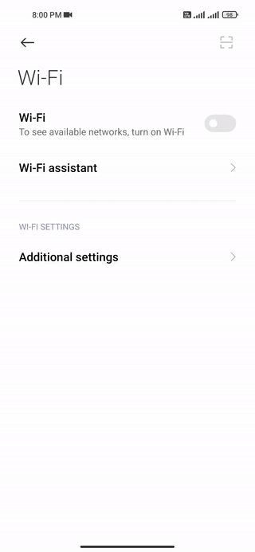

<p align="center">
  
  
  
</p>

A native Android app for signing in to the Pulchowk campus Wi-Fi portal.

## Download the app

[Download v1.3.1 - four signed APKs](https://github.com/rohityadav-sas/pcampus-login/releases/tag/v1.3.1)

Choose the APK that fits your phone. Try them in this order:

| # | APK | Best For | Branch / Package |
|:-:|-----|----------|-------------------|
| 1 | `Campus-WiFi-v1.3.1-root.apk` | 🔓 **Rooted devices** with Magisk/su. No permanent notification. | `root`<br>`wifi.login.root` |
| 2 | `Campus-WiFi-v1.3.1-foreground.apk` | ⭐ **Recommended for non-root users.** Requires a permanent notification. | `permanent-notification`<br>`wifi.login.foreground` |
| 3 | `Campus-WiFi-v1.3.1-legacy.apk` | 📱 **Android 6–14.** Uses older Wi-Fi connection broadcasts. No permanent notification. | `main`<br>`wifi.login.auto` |
| 4 | `Campus-WiFi-v1.3.1-modern.apk` | 📱 **Android 15+** Uses network callbacks with a one-shot wake-up subscription. No permanent notification | `android-15`<br>`wifi.login.android15` |

> **Note:** Start with option 2 on non-rooted phones. On **Xiaomi/MIUI**, enable **Autostart**, set battery usage to **No restrictions**, and allow notifications. Background restrictions can affect all variants, but option 4 is especially vulnerable to process killing or freezing. If automatic login stops, reopen the app.

## 🎬 Demo

<p align="center">
  
</p>

## ✨ Modes

- **Automatic-login mode:** when the phone connects to campus Wi-Fi and gets a `10.100.x.x` address, the app tries to sign in automatically.
- **One-tap login mode:** if automatic login is off, open the app to sign in manually.
- **Manual Login button:** you can also start a login from inside the app.
- **Notifications:** the app can show whether login is in progress, successful, or failed.

## 🪟 Build the APK on Windows

This project is designed so a beginner can build it from PowerShell without installing Android Studio. Download and extract the repository ZIP from GitHub's **Code → Download ZIP** menu if Git is not installed; otherwise clone it below.

On a fresh Windows installation, allow the local scripts in the current PowerShell window first:

```powershell
Set-ExecutionPolicy -Scope Process -ExecutionPolicy Bypass
```

This setting ends when you close that window.

### 1. Clone the Repository
```
git clone https://github.com/rohityadav-sas/pcampus-login
```
### 2. Run the setup script

Run:

```powershell
cd pcampus-login
.\setup.ps1
```

The first setup can take several minutes because Java and Android SDK files may need to be downloaded and extracted.

### 3. Build a Debug APK

```powershell
.\apk.ps1 -Debug
```

The first build may also download Gradle and some build dependencies. This is normal and usually happens only once.

When the build finishes, the Debug APK will be at this location:

```text
app\build\outputs\apk\debug\app-debug.apk
```

### 4. Build a release apk

Run:

```powershell
.\setup-keys.ps1
```

You will be asked to enter and confirm a password.

The script creates:

```text
signing\release.p12
keystore.properties
```

These files are private and are ignored by Git.

**Important:** keep `release.p12` and its password backed up somewhere safe.

You only need to run `setup-keys.ps1` once.

### 5. Build the Release APK

After release signing is set up, run:

```powershell
.\apk.ps1 -Release
```

The Release APK will be at this location:

```text
app\build\outputs\apk\release\app-release.apk
```

## 📱 Install directly from PowerShell

If you have an Android phone connected with USB debugging enabled, you can build and install in one command.

Debug:

```powershell
.\apk.ps1 -Debug -Install
```

Release:

```powershell
.\apk.ps1 -Release -Install
```

## 🧰 Command summary

| Command | What it does |
| --- | --- |
| `.\setup.ps1` | Sets up Java and the Android SDK |
| `.\setup-keys.ps1` | Creates the private release signing key once |
| `.\apk.ps1` | Builds a Debug APK |
| `.\apk.ps1 -Debug` | Builds a Debug APK |
| `.\apk.ps1 -Release` | Builds the signed Release APK |
| `.\apk.ps1 -Install` | Builds Debug and installs it on a connected phone |
| `.\apk.ps1 -Release -Install` | Builds Release and installs it on a connected phone |

## 🎨 Change the app icon

1. Add your icon to `assets/icon/`. SVG and PNG are supported.
2. If using PNG, it must be **1024 × 1024 pixels**. Keep the artwork centered, with minimal empty space around it. Color and transparency are supported.
3. Choose the icon format to build with:

```powershell
   .\apk.ps1 -Release -Icon png
   .\apk.ps1 -Release -Icon svg
```

   - If only one icon file is present, you can simply run `.\apk.ps1 -Release`.
   - If both are present and `-Icon` is not specified, the script will prompt you to choose one.

## 📱 Using the app

1. Install the APK and open the app.
2. Enter your campus username and password.
3. Turn on **Automatic login** if you want the app to sign in automatically.
4. Save the settings.
5. Connect to campus Wi-Fi.

If automatic login is off, open the app whenever you want to sign in.

On Android 7.1 and newer, you can long-press the app icon and open **Settings** if the shortcut is available.

### MIUI / Xiaomi phones

MIUI may restrict apps in the background.

If automatic login does not work, allow:

- Autostart
- Notifications
- Floating notifications
- Notification sound, if wanted

MIUI may reset some of these permissions after an app update.

## 📶 How automatic login works

Android delivers Wi-Fi availability events through a system-owned `PendingIntent` network subscription, which can outlive the app process. The app checks whether the phone has a `10.100.x.x` IP address and, if it matches, sends the login request immediately. It does not wait for internet validation or an authentication-required event, and does not poll.

Registration is restored when the app opens, after reboot, and after an update. Disabling automatic login removes it. After manually force-stopping the app, open it again to restore background operation. On Android 13+, allow notification permission to see login progress and results.

Login can sometimes be delayed by:

- slow DHCP
- weak Wi-Fi
- Android background restrictions
- phone manufacturer power-saving features
- a slow campus portal response

## ⚠️ Android compatibility

The app supports installation from Android 6-16. This **Permanent Notification** variant runs a foreground service with a Wi-Fi network callback while automatic login is enabled. The ongoing notification lets Android keep that listener active more reliably.

## 🔐 Privacy and security

Your campus username and password are entered and stored on your phone.

They are stored inside the app's private data area. Android backup is disabled.

The app does not include analytics or send your credentials to another service.

## 🧪 Contributing

For contribution information, see [CONTRIBUTING.md](CONTRIBUTING.md).

### Platform references

- [Android 15 minimum target requirement](https://developer.android.com/about/versions/15/behavior-changes-all#minimum-target-api-level)
- [PendingIntent network callbacks](https://developer.android.com/reference/android/net/ConnectivityManager#registerNetworkCallback(android.net.NetworkRequest,%20android.app.PendingIntent))
- [Android Gradle Plugin 8.13 compatibility](https://developer.android.com/build/releases/agp-8-13-0-release-notes)
